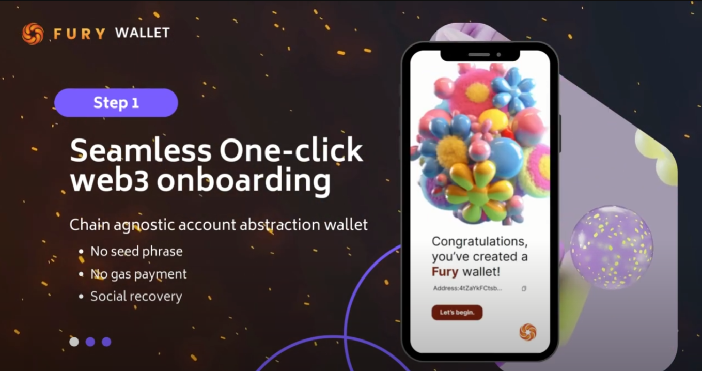
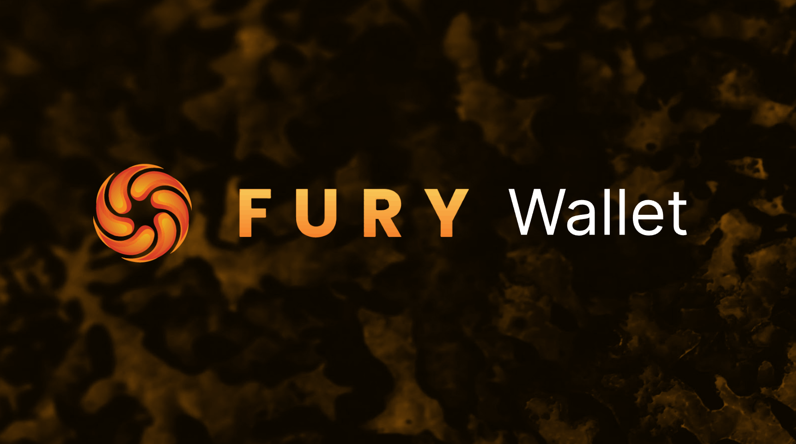
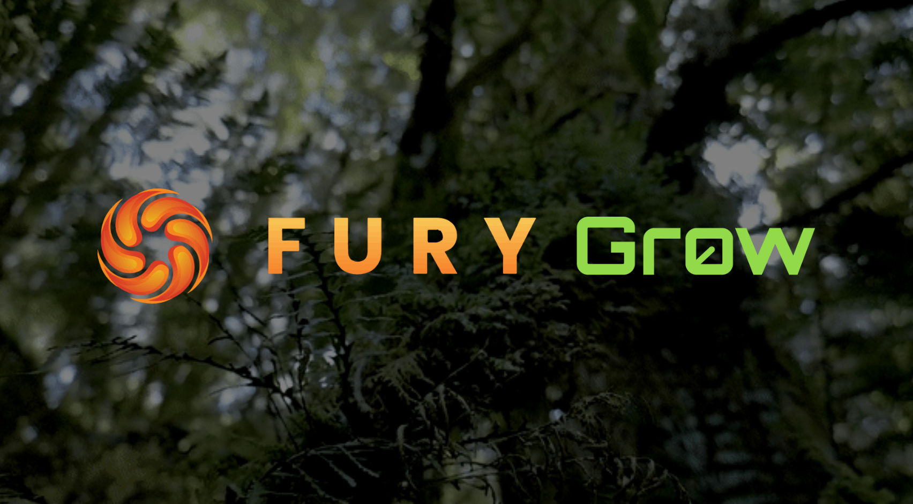
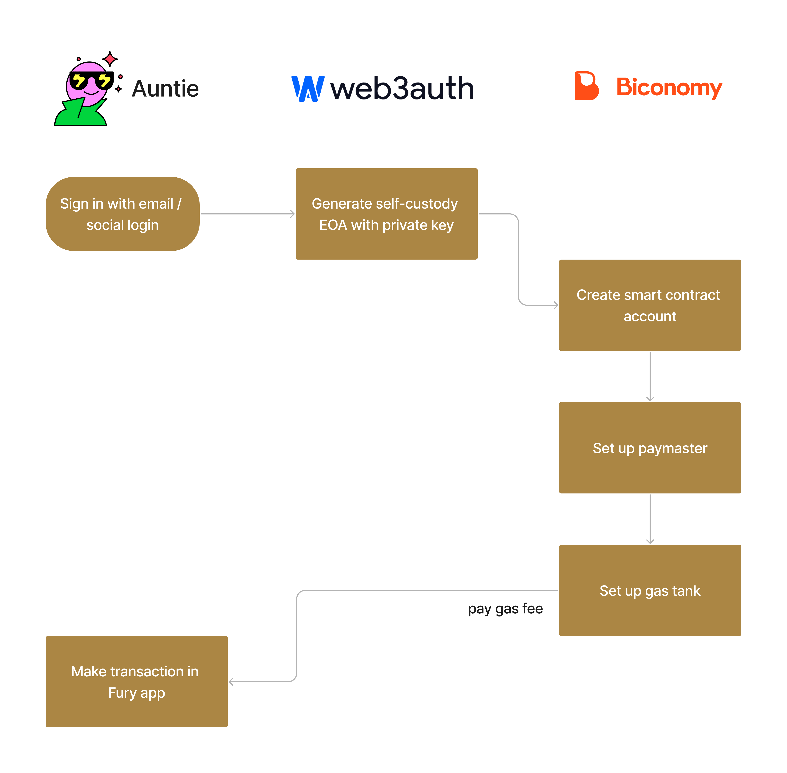

# 0xFury Smart Contract Wallet with Account Abstraction and Re-fi

# Project Name

### Fury Wallet

Most of the wealth is stuck in the TradFi owned by elderly that are proportionately less digital literate. They want to invest in the high-yield DeFi but are struggling with the user experience of web3. We believe that account abstraction is the key to unlocking mass adoption. By simplifying the user experience and providing intuitive tools for managing web3 wallets, we can empower everyone to seamlessly navigate the DeFi landscape.

### Fury Grow

Turn green into gold! Fury Grow encourages users to lower carbon emissions by planting trees when users engage in activities that reduce carbon emissions. A new plant is planted when Plant NFTs are Adopted on our platform.

- Plant Adoption: Users can browse and select available plants for adoption
- Carbon Credit Generation: Users earn simulated carbon credits for adopting plants.
- Nurturing and Monitoring (Simulated): Users receive simulated updates on their adopted plant’s growth progress.
- User Dashboard: Users can view their adopted plant(s), earned carbon credits, and token balance.
- UI/UX: A simple and intuitive user interface for the landing page, plant adoption, and user dashboard.

## Demo Video:

#### Fury Wallet - App Promotional Demo Walkthrough

#### Fury Wallet - Account Abstration Demo

---

<!-- [Fury Wallet - Account Abstration Demo](https://www.youtube.com/watch?v=TkgNQpYZ2W0&list=PLZQCAgLa_FYlVp6OeTsbSYm0PvJBTRGVU) -->

#### Fury Grow - Regenerative Finance Demo

---

<!-- [Fury Wallet - Regenerative Finance Demo](https://www.youtube.com/watch?v=m1jKw-8RORQ&list=PLZQCAgLa_FYlVp6OeTsbSYm0PvJBTRGVU&index=2) -->

## Information

- Created at: [Sol Hyperdrive 2023 Global Hackathon](https://solana.com/hyperdrive)
- Presentation deck: [Fury](https://docs.google.com/presentation/d/e/2PACX-1vQTv2Pq8YrUmt_tHP28IabxOO_XUQ-aGsKbqPAhYn2x0G84WQdvWJAF9MdE24jVoaHK34nVSmku3N_z/pub)
- App Demo: [Fury App Walkthrough](https://youtu.be/jaaLMZQyZJM?si=y5_QWSEHbaZLPFrY)
- Figma: [Mockups, wireframes, and logic flow](https://www.figma.com/file/wDWskcAL1KRfD2eGzEnQS8/SOL-Hackathon-2023)
- Github: [Repo](https://github.com/zihanlim/0xfury_Hyperdrive_SOL)
- Contact: [Twitter](https://twitter.com/0xteamfury)

## Future development

- Implement support for multiple Solana networks, such as Devnet and Testnet. This will allow users to test and deploy their wallets on different networks before using them on the mainnet.
- Develop a mobile app for the wallet, making it more accessible to users. This will make it easier for users to manage their wallets and interact with Solana dApps on the go.
- Integrate with popular Solana dApps and marketplaces. This will allow users to easily manage their assets and interact with other Solana users and projects.
- Add support for new features, such as social recovery and multi-signature transactions. This will make the wallet more secure and flexible for users.
  Improve the security and performance of the wallet. This will make it more reliable and trustworthy for users.
- Build a strong community around the wallet, providing support and education to users. This will help to ensure that the wallet is adopted by a wider range of users and that they are able to use it safely and effectively.

## Architecture diagram

## Getting Started

### Frontend Setup

#### Setup development environment

1. cd frontend folder
2. yarn
3. cp .env.example .env
4. Fill in REACT_APP_GOOGLE_ID_CLIENT
5. yarn start/npm run dev

#### Setup progresive web appp

1. cd frontend folder
2. yarn
3. cp .env.example .env
4. Fill in REACT_APP_GOOGLE_ID_CLIENT
5. yarn build
6. yarn global add serve (if you not installed it yet)
7. npx serve -s build
8. you should see pop up message to install the app.
